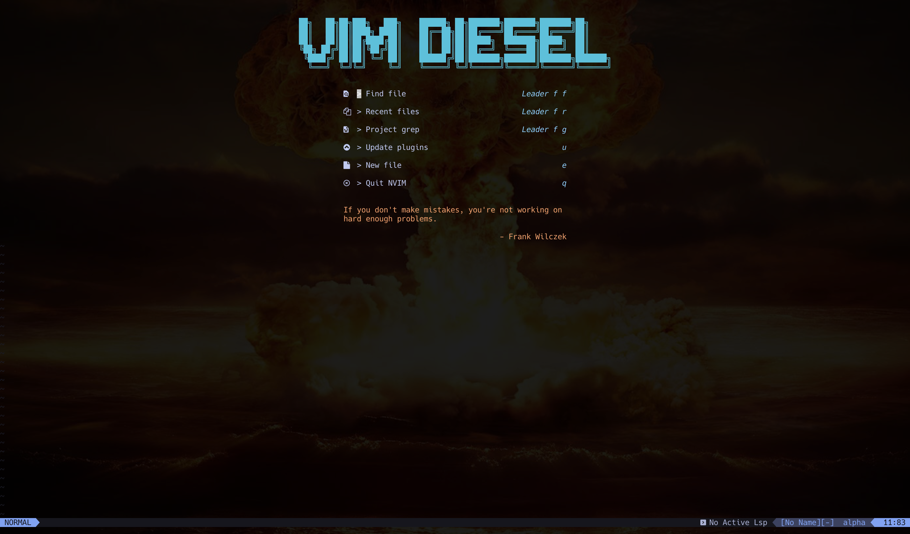

# Vim Diesel

## Neovim configs who want to go 2fast2furious

## Keymapping

- `SPC-vv` -> new vertical buffer
- `SPC-wq` -> save quit
- `SPC-qq` -> quit
- `SPC-so` -> source
- `SPC-ww` -> save

## Features

### Config

- [Packer](https://github.com/wbthomason/packer.nvim) to manage dependencies
- [impatient](https://github.com/lewis6991/impatient.nvim)
- [mason.nvim](https://github.com/williamboman/mason.nvim) package manager LSPs, linters, etc.
- [mason-lspconfig.nvim](https://github.com/williamboman/mason-lspconfig.nvim) easier to use with lspconfig
- [nvim-lspconfig](https://github.com/neovim/nvim-lspconfig)
- [nvim-treesitter](https://github.com/nvim-treesitter/nvim-treesitter) code highlighting
- Git integration [fugitive.vim](https://github.com/tpope/vim-fugitive)
- Git changes with [vim-gitgutter](https://github.com/airblade/vim-gitgutter)

### Addo-Ons

- [telescope.nvim](https://github.com/nvim-telescope/telescope.nvim) fuzzy finder over lists
- Terminal emulator with [toggleterm](https://github.com/akinsho/toggleterm.nvim)

### Text

- [nvim-cmp](https://github.com/hrsh7th/nvim-cmp) completion plugin
- [onsails/lspkind.nvim](https://github.com/onsails/lspkind.nvim) adds vscode-like pictograms to neovim built-in lsp
- Auto syntax closer with [nvim-autopairs](https://github.com/windwp/nvim-autopairs)
- [indent-blankline.nvim](https://github.com/lukas-reineke/indent-blankline.nvim)

### Appearance

- Theme [folke/tokyonight.nvim](https://github.com/folke/tokyonight.nvim)
- Home screen [alpha-nvim](https://github.com/goolord/alpha-nvim)
- Color highlighter [nvim-colorizer.lua](https://github.com/norcalli/nvim-colorizer.lua)
- [todo-comments.nvim](https://github.com/folke/todo-comments.nvim)
- [vim-matchup](https://github.com/andymass/vim-matchup) navigate and highlight matching words + HTML tags

## Inspo

- [tiagovla](https://github.com/tiagovla/.dotfiles/tree/master/neovim/.config/nvim)
- [simple](https://github.com/brainfucksec/neovim-lua)
- [jdhao](https://github.com/jdhao/nvim-config)

## Resources

- [Everything you need to know to configure neovim using lua](https://vonheikemen.github.io/devlog/tools/configuring-neovim-using-lua/)
- [From init.vim to init.lua](https://teukka.tech/luanvim.html)
- [nvim-lua-guide](https://github.com/nanotee/nvim-lua-guide)
- [Neovim medium series](https://alpha2phi.medium.com/learn-neovim-the-practical-way-8818fcf4830f#545a)
- [Getting started guide](https://bryankegley.me/posts/nvim-getting-started/)
